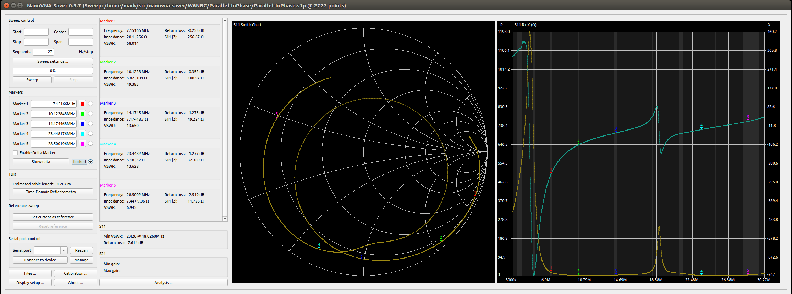
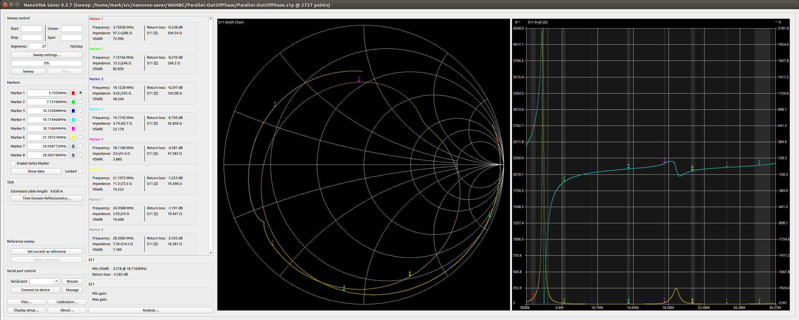
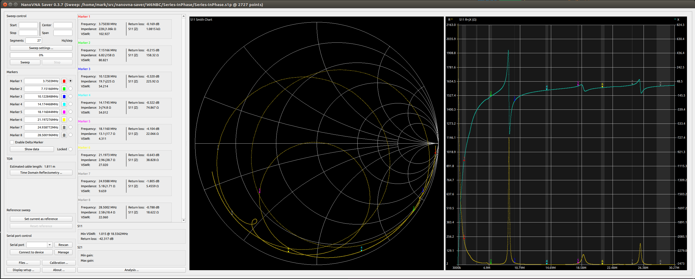
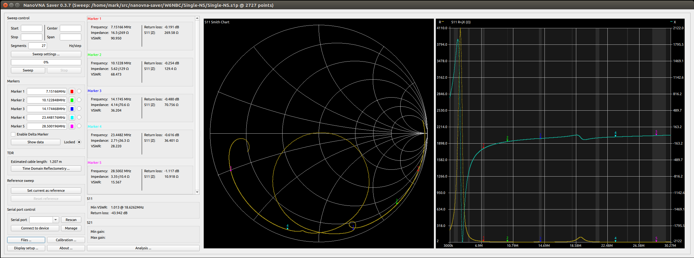
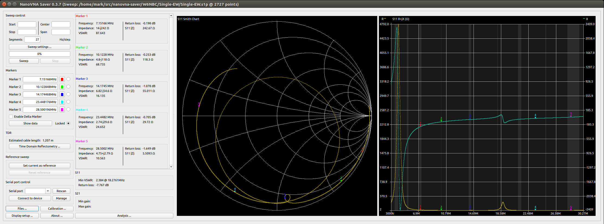
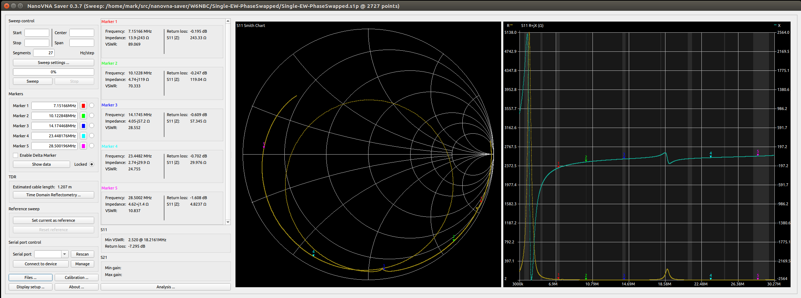

# Update 2021-01-01:
Added a lot more to `make_matching_network.py`:
* Calculates the idea matching network.
* Rounds those values to the nearest 10pF and 100nH, the resolution of the RT-600 remote tuner.
* Calculates the actual impedance and SWR seen by the radio with that antenna impedance and actual matching network.

All my `.s1p` files, and the script, are here if you want to work on this yourself.  I'll save you the work, here's the data:
## Parallel loops
```
--------Measurements:--------   -----Ideal Matching Network:----   -Actual Matching Network:-   ---------Actual Impedance:--------
--Freq:--  ---R:--  ----X:---   ----C:---  ----L:----  ----C:---   ---C:--  ---L:---  ---C:--   ---R:---  ----X:---  --|Z|-  -SWR-
  3.75MHz   103.19     +2.17j               2189.69nH   432.84pf              2200nH    430pf      50.35     +0.23j    50.3   1.01
  7.15MHz    90.38    -29.28j               1111.44nH   150.38pf              1100nH    150pf      50.09     -0.51j    50.1   1.00
 10.12MHz    71.42    -42.60j                761.03nH    60.30pf               800nH     60pf      50.09     +2.48j    50.2   1.00
 14.17MHz    39.73    -44.18j    114.19pf    723.10nH                110pf     700nH               48.01     -0.66j    48.0   1.04
 18.11MHz     8.42     +7.23j    390.71pf    100.90nH                390pf     100nH               49.54     +0.59j    49.5   1.01
 21.20MHz    67.07    -39.50j                337.10nH    25.70pf               300nH     30pf      47.48     -5.14j    47.8   1.05
 24.94MHz    18.35    -31.20j    167.62pf    352.89nH                170pf     400nH               69.25    -14.68j    70.8   1.42
 28.50MHz     5.14     -0.04j    329.91pf     85.05nH                330pf     100nH               53.89    -26.80j    60.2   1.20
```
## Series loops
```
--------Measurements:--------   -----Ideal Matching Network:----   -Actual Matching Network:-   ---------Actual Impedance:--------
--Freq:--  ---R:--  ----X:---   ----C:---  ----L:----  ----C:---   ---C:--  ---L:---  ---C:--   ---R:---  ----X:---  --|Z|-  -SWR-
  3.75MHz   100.28    -12.61j               2161.38nH   371.94pf              2200nH    370pf      50.23     +0.91j    50.2   1.00
  7.15MHz    83.44    -35.79j               1099.39nH   125.93pf              1100nH    130pf      49.10     +0.02j    49.1   1.02
 10.12MHz    96.50    -17.47j                783.72nH   128.70pf               800nH    130pf      49.59     +1.04j    49.6   1.01
 14.17MHz    56.30    -46.16j                527.68nH    14.29pf               500nH     10pf      51.83     -2.31j    51.9   1.04
 18.11MHz    28.05    -39.11j    155.51pf    561.77nH                160pf     600nH               58.34     -1.33j    58.4   1.17
 21.20MHz    45.04    -41.22j     49.80pf    421.65nH                 50pf     400nH               48.13     -2.59j    48.2   1.04
 24.94MHz     9.61    -20.73j    261.72pf    257.99nH                260pf     300nH               60.72    -35.53j    70.4   1.41
 28.50MHz    24.14    -35.02j    115.58pf    335.09nH                120pf     300nH               38.51     -2.14j    38.6   1.30
```
## Single loop
```
--------Measurements:--------   -----Ideal Matching Network:----   -Actual Matching Network:-   ---------Actual Impedance:--------
--Freq:--  ---R:--  ----X:---   ----C:---  ----L:----  ----C:---   ---C:--  ---L:---  ---C:--   ---R:---  ----X:---  --|Z|-  -SWR-
  3.75MHz   102.22     -5.33j               2174.38nH   402.69pf              2200nH    400pf      50.33     +0.60j    50.3   1.01
  7.15MHz    90.85    -28.85j               1113.05nH   151.91pf              1100nH    150pf      50.43     -0.58j    50.4   1.01
 10.12MHz    76.20    -40.49j                768.16nH    71.71pf               800nH     70pf      50.53     +2.04j    50.6   1.01
 14.17MHz    52.49    -46.32j                522.98nH     5.88pf               500nH     10pf      48.32     -2.14j    48.4   1.03
 18.11MHz    21.28    -32.97j    204.21pf    506.98nH                200pf     500nH               48.15     +1.35j    48.2   1.04
 21.20MHz    53.06    -42.70j                324.74nH     5.19pf               300nH     10pf      47.29     -3.60j    47.4   1.05
 24.94MHz    18.40    -32.56j    167.23pf    361.67nH                170pf     400nH               65.87    -10.99j    66.8   1.34
 28.50MHz     6.32    -14.32j    293.63pf    172.76nH                290pf     200nH               52.15    -37.71j    64.4   1.29
```
## Analysis: What the...
What the Heck?  Why are those numbers so dang close?  I'd expect the complex impedance of a single loop Z, when in parallel to be Z/2, and when in series to be 2Z.  But that's not what we're seeing.  My MATH is right, the source R+jX values are awfully close.  So either my understanding of antennas in parallel/series is wrong, or my measurements of the antenna is wrong.

More later. 73 de KR6ZY

# Update 2020-12-28:
So, apparently, I've been suckered into presenting this data and analysis at [BayCon 2021](http://www.bay-net.org/baycon-radio-conference.html) by George, KJ6VU.  Which means I need to actually do something useful with this data.  So, here goes.

## Blog Format
To keep the history, I'm changing this `README.md` to a blog-like format, with date stamp headers, and keeping historic entries below.

## Antenna Status
tl,dr: I'm making progress. I finally finished some blocker-projects (notably: running cables to the antenna), and I've got another two weeks of vacation in front of me. Getting this antenna built and usable is my top project goal.  I hope to get some better data tomorrow.

## Data Quality
The data presented in the 2020-10-17 update below is highly suspect.  I don't trust the wiring in the switch box I made, so I've rebuilt the balun/loop configuration box and, once the weather dries up (first rain of the year today! Hey, I live in California, this is a big deal...) I'll go out, hook it up, and re-measure the antenna in the various configurations.

## Automating Analysis
Today, I wrote a python script called `make_matching_network.py` which uses the S11 parameters from the NanoVNA and calculates the L matching network needed to match that to a 50+j0 ohm load.  It uses the [scikit-rf](https://github.com/scikit-rf/scikit-rf) Python module to parse the `s1p` Touchstone files from NanoVNA Saver and convert the S parameters to R+jX values.  I stole the math from [the source](view-source:https://home.sandiego.edu/~ekim/e194rfs01/jwmatcher/matcher2.html) of [this page](https://home.sandiego.edu/~ekim/e194rfs01/jwmatcher/matcher2.html).

Running `make_matching_network.py` passing it at least one `s1p` filename on the command line, it calculates the L and C vaules needed to match that configuration to a 50+j0 impedance at the center(ish) of the 80, 40, 30, 20, 17, 15, 12, and 10m bands.  (You can edit the script, and update `freqs` if you want to change the frequencies it works on.)

I'm using the data files from 2020-10-17 for testing my code, but I'll re-run it after collecting more trustworthy data, hopefully tomorrow.

## What are we Analyzing?
My goal is to identify the "best" configurations for each band, but what is "best?"
* At the very least, verifying the tuner CAN match it.  Not even being able to match the antenna is definitely not "best."
* In the best case, identify the most efficient tuner setting.

### Will It ~~Blend~~ Match?!
My remote tuner is the [LDG RT-600](https://ldgelectronics.com/index.php/products/remote/rt-600/).  "Have screwdriver, will reverse engineer."  See [RT-600.md](RT-600.md) for details of what I found, but tl,dr is: it's basically an L network with a series inductor and parallel capacitor, that can switch the capacitor to either side of the inductor.  The capacitor can be anything from 0pF to 1270pF in 10pF steps.  The inductor can be anything from 0nH to 12700nH in 100nH steps.

So any calculated L between 0nH and 12700nH, and any calculated C between 0pF and 1270pF, should be matchable by the tuner to some level of precision.

### Do You Even ~~Lift~~ Match, bro?
Making the matching network efficient is a different thing.  To be honest, I haven't looked into calculating efficiency of a matching network.  I'm going to type something now that will either make me look like a fool, or a naturally gifted genius who understands this stuff intuitively...

I think efficiency is worse the more L and C you need to match the load.  So smaller L and C values are better.

## Conclusion Goals
Given all the above, the goal is to:
* Use the NanoVNA to analyze the antenna in three different configurations:
  * Single Loop
  * Parallel Loops
  * Series Loops
* Calculate the matching network required to match each configuration to a 50+j0 load on each of the ham bands.
* Verify my tuner can handle it: L > 12700nH, C > 1270pF
* Idenfity which configuration has lower L and C values.
  * TODO: What to do if one config has a better L but the other has a better C?  Might have to break out some actual math.
* Is one configuration a clear winner for all bands?  Or is the "best" configuration different for each band?
  * If different, calculate the worst case efficiency for each configuration.  Then it's a judgement call whether that efficiency loss is worth the added switching complexity.

73 de KR6ZY
-Mark

# Update 2020-10-17
## Caveat with the data
I'm posting the first data I collected on 2020-10-17.  BUT: I think I've got some bad wiring, loose connectors, or something. It's pretty noisy when things move of jiggle. So this data is pretty suspect, even though the graphs look smooth.  That just means I managed to sit still while the collection was running.  There some pretty different data below that should be very similar, and it's not.

## How this was collected:
I used my NanoVNA-F, and [NanoVNA-Saver](https://github.com/NanoVNA-Saver/nanovna-saver) v0.3.7.  I configured Saver to scan from 3.0MHz to 30.27MHz with 27 Segments. This SHOULD have had it testing every 10kHz, but the raw data suggests otherwise.  _sigh_  Anyway.  That raw data was saved into the respective directories.  

I also wrote a script that takes the raw data and splits it out by band into individual smaller Saver files.  That raw data is included here, but Saver doesn't have a way to automate displaying and capturing data, so for the PNGs and tabular data, I'm just using the full spectrum file to minimize the number of screen captures I need to take.

The configurations I tested are:
* Both loops in parallel:
  * EW loop "in phase"
  * EW loop "out of phase"
* Both loops in series:
  * EW loop "in phase"
  * EW loop "out of phase"
* Indiviual loops:
  * NS loop
  * EW loop "in phase" (that relay in it's unenergized state)
  * EW loop "out out phase" (that relay energized. SHOULD BE no different at all.)

The configurations were switched with relays as described in the `Switching` directory parallel to this one.

## Expectations:
* I expect the Phase to not affect the impedance of the antenna much, so the "in phase" and "out of phase" version of Paralle and Series should be very similar.
* I expect the Parallel loops to be a lower impedance than the Single loops, and the Series loops to be a higher impedance than the Single loops.
* I expect the two Single loops to be about the same, though will probably have some slight difference just from differences in construction and their environment.

## Tabular data
This table just summarizes the complex impedances at the markers in each of the images below.  I THINK the R+jX values are what you need
to figure out how hard your tuner is working?  Maybe?

| Configuration         | 80m 3.75MHz | 40m 7.15MHz | 30m 10.12MHz | 20m 14.17MHz | 17m 18.11MHz | 15m 21.20MHz | 12m 24.94MHz | 10m 28.5MHz |
|-----------------------|-------------|-------------|--------------|--------------|--------------|--------------|--------------|-------------|
| Parallel In Phase     | 494+j375    | 20.1-j256   | 5.82-j109    | 7.17-j48.7   | 31.1+j31.2   | 15.6-j52.3   | 3.9-j19.4    | 7.44+j9.06  |
| Parallel Out of Phase | 97.5+j586   | 15.2-j246   | 4.62-j105    | 3.74-j42.7   | 23.0+j41.6   | 11.2-j73.5   | 3.92-j19     | 7.56+j14.5  |
| Series In Phase       | 228-j1.04k  | 6.82-j158   | 19.7-j225    | 3.0-j74.8    | 13.1-j17.7   | 2.96-j38.7   | 5.18-j1.71   | 2.58-j18.4  |
| Series Out Of Phase   | 219-j1.06k  | 7.30-j160   | 18.7-j219    | 2.96-j73.3   | 7.56-j23.4   | 3.64-j41.1   | 5.64-j477m   | 2.66-j17.5  |
| Single NS             | 1k+j1.6k    | 16.5-j269   | 5.62-j129    | 4.14-j70.6   | 21.9-j11.1   | 6.19-j56.8   | 2.43-j27.6   | 3.35-j10.4  |
| Single EW             | 1.8k+2.26k  | 14.0-j242   | 4.8-j118     | 6.82-j54.6   | 23.8+j20.7   | 4.26-j50.8   | 2.81-j20.1   | 4.75+j2.79  |

## Graphs!
### Parallel, In Phase


### Parallel, Out of Phase


### Series, In Phase


### Series, Out of Phase


### Single, North/South loop


### Single, East/West loop, "In Phase"


### Single, East/West loop, "Out of Phase"


