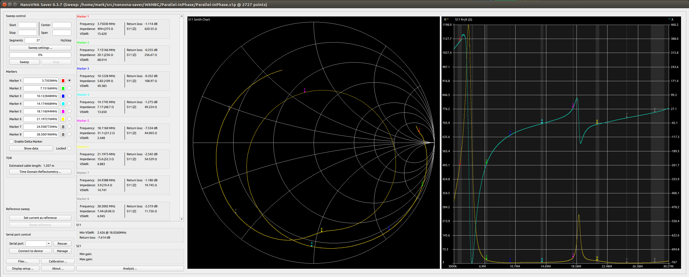
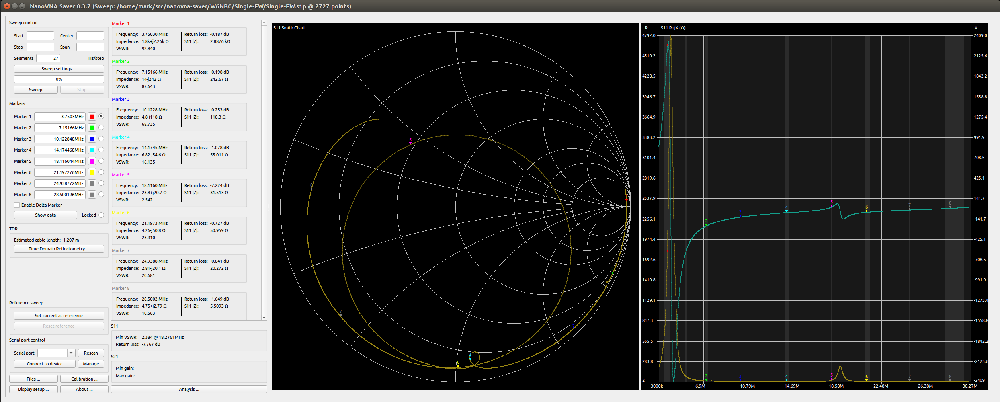

# Caveat with the data as of 2020-10-17
I'm posting the first data I collected on 2020-10-17.  BUT: I think I've got some bad wiring, loose connectors, or something. It's pretty noisy when things move of jiggle. So this data is pretty suspect, even though the graphs look smooth.  That just means I managed to sit still while the collection was running.  There some pretty different data below that should be very similar, and it's not.

# How this was collected:
I used my NanoVNA-F, and [NanoVNA-Saver](https://github.com/NanoVNA-Saver/nanovna-saver) v0.3.7.  I configured Saver to scan from 3.0MHz to 30.27MHz with 27 Segments. This SHOULD have had it testing every 10kHz, but the raw data suggests otherwise.  _sigh_  Anyway.  That raw data was saved into the respective directories.  

I also wrote a script that takes the raw data and splits it out by band into individual smaller Saver files.  That raw data is included here, but Saver doesn't have a way to automate displaying and capturing data, so for the PNGs and tabular data, I'm just using the full spectrum file to minimize the number of screen captures I need to take.

The configurations I tested are:
* Both loops in parallel:
  * EW loop "in phase"
  * EW loop "out of phase"
* Both loops in series:
  * EW loop "in phase"
  * EW loop "out of phase"
* Indiviual loops:
  * NS loop
  * EW loop "in phase" (that relay in it's unenergized state)
  * EW loop "out out phase" (that relay energized. SHOULD BE no different at all.)

The configurations were switched with relays as described in the `Switching` directory parallel to this one.

# Expectations:
* I expect the Phase to not affect the impedance of the antenna much, so the "in phase" and "out of phase" version of Paralle and Series should be very similar.
* I expect the Parallel loops to be a lower impedance than the Single loops, and the Series loops to be a higher impedance than the Single loops.
* I expect the two Single loops to be about the same, though will probably have some slight difference just from differences in construction and their environment.

# Tabular data
This table just summarizes the complex impedances at the markers in each of the images below.  I THINK the R+jX values are what you need
to figure out how hard your tuner is working?  Maybe?

| Configuration         | 80m 3.75MHz | 40m 7.15MHz | 30m 10.12MHz | 20m 14.17MHz | 17m 18.11MHz | 15m 21.20MHz | 12m 24.94MHz | 10m 28.5MHz |
|-----------------------|-------------|-------------|--------------|--------------|--------------|--------------|--------------|-------------|
| Parallel In Phase     | 494+j375    | 20.1-j256   | 5.82-j109    | 7.17-j48.7   | 31.1+j31.2   | 15.6-j52.3   | 3.9-j19.4    | 7.44+j9.06  |
| Parallel Out of Phase | 97.5+j586   | 15.2-j246   | 4.62-j105    | 3.74-j42.7   | 23.0+j41.6   | 11.2-j73.5   | 3.92-j19     | 7.56+j14.5  |
| Series In Phase       | 228-j1.04k  | 6.82-j158   | 19.7-j225    | 3.0-j74.8    | 13.1-j17.7   | 2.96-j38.7   | 5.18-j1.71   | 2.58-j18.4  |
| Series Out Of Phase   | 219-j1.06k  | 7.30-j160   | 18.7-j219    | 2.96-j73.3   | 7.56-j23.4   | 3.64-j41.1   | 5.64-j477m   | 2.66-j17.5  |
| Single NS             | 1k+j1.6k    | 16.5-j269   | 5.62-j129    | 4.14-j70.6   | 21.9-j11.1   | 6.19-j56.8   | 2.43-j27.6   | 3.35-j10.4  |
| Single EW             | 1.8k+2.26k  | 14.0-j242   | 4.8-j118     | 6.82-j54.6   | 23.8+j20.7   | 4.26-j50.8   | 2.81-j20.1   | 4.75+j2.79  |

# Graphs!
## Parallel, In Phase

## Parallel, Out of Phase

## Series, In Phase

## Series, Out of Phase

## Single, North/South loop

## Single, East/West loop, "In Phase"

## Single, East/West loop, "Out of Phase"

